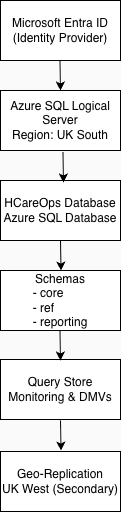

# Architecture

## High-Level Architecture

This diagram illustrates the logical and regional design of the Azure SQL Database solution.

---

## Logical Design

...

## High-Level Design

- Azure SQL Database (General Purpose, serverless) in UK South.
- Geo-replicated secondary in UK West for DR.
- Private endpoints into a shared hub VNet.
- Microsoft Entra ID authentication and least-privilege access.

## Non-Functional Requirements

- RPO: ≤ 15 minutes (PITR and geo-replication).
- RTO: < 1 hour (planned geo-failover).
- 99.95% availability per Azure SQL SLA.

## Components (to be expanded)

- Data tier (Azure SQL Database, geo-secondary).
- Network and security (VNets, private endpoints, Key Vault).
- Monitoring and operations (Log Analytics, Azure Monitor).
- Backup and DR (PITR, LTR, geo-replication and runbooks).
